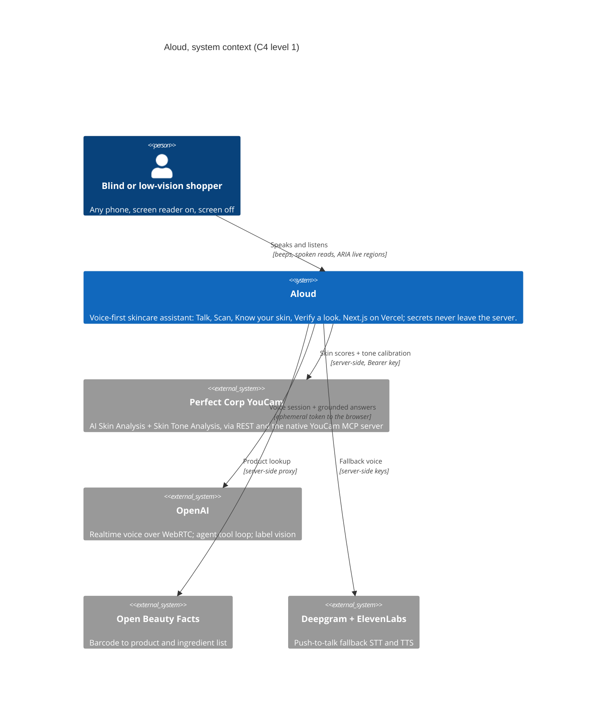

# ALOUD

**Beauty, aloud. The first beauty AI a blind shopper can use alone, with the screen off.**

[](https://github.com/StephenSook/aloud/actions/workflows/ci.yml)
[](https://aloudbeauty.vercel.app)
[](LICENSE)
[](package.json)
[](tests/)
[](https://youcam-api.devpost.com/)

Built for the **YouCam API Skin AI & Apparel VTO Hackathon** on the Perfect Corp YouCam AI Skin Analysis API. Aloud speaks appearance, never medicine: a claim linter in CI blocks medical language from ever being spoken.

## Judge quick access

| To verify... | Go here |
|---|---|
| **Try it, zero setup** | [aloudbeauty.vercel.app](https://aloudbeauty.vercel.app) on any phone, screen reader on, screen off |
| **The 3-minute demo** | [Demo video](https://youtu.be/RndOBX249KE) (real device recordings, real products, live API) |
| **Claims are wired, not aspirational** | [`docs/FACTS.md`](docs/FACTS.md) wired-integration ledger, grep any row in the shipped code |
| **It reproduces on your machine** | [Quickstart](#quickstart): clone, `npm install`, gates and build pass with zero keys |
| **Safety is engineered** | [`docs/GUARDRAILS.md`](docs/GUARDRAILS.md) + `npm run guardrail` (CI-blocking claim linter) |

## Live surfaces

| Surface | URL |
|---|---|
| Demo video (2:55) | https://youtu.be/RndOBX249KE |
| Web app (primary) | https://aloudbeauty.vercel.app |
| iOS (TestFlight) | https://testflight.apple.com/join/AKWHYekX |
| Android (APK) | https://github.com/StephenSook/aloud/releases/latest |
| Code | https://github.com/StephenSook/aloud |

## Get the app

Prefer no install? The web app runs on any phone in the browser: **[aloudbeauty.vercel.app](https://aloudbeauty.vercel.app)**. For the native apps, scan:

<table>
  <tr>
    <td align="center"><br><b>iOS</b><br><sub>TestFlight beta</sub></td>
    <td align="center"><br><b>Android</b><br><sub>installable APK</sub></td>
  </tr>
</table>

- **iOS**: scan the code, or open [testflight.apple.com/join/AKWHYekX](https://testflight.apple.com/join/AKWHYekX) in the TestFlight app.
- **Android**: scan the code, or download the APK from [Releases](https://github.com/StephenSook/aloud/releases/latest); allow "install unknown apps" and tap to install.

The native apps are Capacitor shells around the same live web app, so they stay current with every web deploy. Build details in [`docs/NATIVE.md`](docs/NATIVE.md).

## How it works (the four flows)

1. **Talk** (`/talk`): a hands-free voice conversation over WebRTC (OpenAI Realtime). The model calls real tools: EU CosIng ingredient lookup, EU fragrance-allergen check, and barcode product lookup. Every reply is mirrored as text.
2. **Scan** (`/scan`): beep-guided barcode finding, then a layered spoken read: product identity, allergen status in what-the-label-lists language, marquee-ingredient functions, full list on request, free-form follow-up questions.
3. **Know your skin** (`/capture`): audio-guided non-visual selfie framing (tonal hot-cold cues, steadiness hold, lighting gate, auto-capture), then a spoken read grounded only in the YouCam AI Skin Analysis structured scores, with honest uncertainty.
4. **Verify a look** (`/verify`): after makeup, the same guided capture compares scores against the session's bare-skin baseline and speaks the deltas, with the uncertainty stated plainly.

## YouCam API integration (the call flow)

`app/api/skin` registers the image with `POST /s2s/v2.0/file/skin-analysis`, PUTs the bytes to the presigned URL, creates the task with `POST /s2s/v2.0/task/skin-analysis` (SD concerns, `format: json`), and the client polls `GET /s2s/v2.0/task/skin-analysis/{task_id}` through a thin proxy. The Bearer key lives only in server env; response shapes and error tuples are pinned by live-captured fixtures in `tests/fixtures/youcam/`. Every spoken skin statement traces to a `ui_score`; the face image never goes to a general vision model.

## The problem

Skincare e-commerce is heavily visual. Product images, ingredient lists, and shade information are often unavailable to a screen reader, so a blind shopper cannot independently learn what a product is, what is in it, or whether it suits them. It is a documented, litigated barrier: beauty retailers have been sued specifically over inaccessible e-commerce (Sephora 2017, Fenty Beauty 2019, Ulta 2019). In the US, 8.5 million adults are blind or have serious difficulty seeing (2024 ACS). iOS is 70.6 percent of screen-reader users, so Aloud runs in a mobile browser.

## What it does

- **Reads and matches products.** Scan a barcode, hear the product and its ingredients read out loud, and get it matched to your stated needs in plain cosmetic language.
- **Reads your skin.** Capture a selfie with non-visual audio-guided framing, and hear an objective skin-state read grounded only in structured analysis scores from the YouCam AI Skin Analysis API, with honest uncertainty.
- **Verifies a makeup look.** After applying makeup, hear a description of coverage and evenness, scoped to honest uncertainty.

Everything is spoken, operable with no screen, and never makes a medical or treatment claim.

## Architecture



Deeper decisions with their rejected alternatives live in [`docs/adr/`](docs/adr/).

- **Next.js App Router + TypeScript on Vercel.** One app, one deploy, HTTPS everywhere (the camera and mic require it).
- **Server (Route Handlers):** proxy for the Perfect Corp **YouCam AI Skin Analysis API** (file register, presigned PUT, task create, poll) and Open Beauty Facts; agent tool loop (Vercel AI SDK); ephemeral token mint for realtime voice. The skin analysis can also be routed through Perfect Corp's **native YouCam MCP server** (`lib/youcam-mcp.ts`, the `Perfect Corp MCP` toggle on the capture screen), returning the same real scores. All secrets stay server-side.
- **Bias-aware honesty:** Perfect Corp's **Skin Tone Analysis** runs in parallel; the returned skin color becomes ITA, a neutral color metric. On deeper tones or low light, where dermatology documents reduced reliability of readings like redness, the read lowers its confidence and says so. Tone calibrates honesty only: never stated as identity, never tied to race, never stored.
- **Browser:** MediaPipe face detection for audio-guided non-visual capture, html5-qrcode for barcode scanning, ARIA live regions and managed focus for screen-reader-native flows.
- **Voice:** OpenAI Realtime over WebRTC (works on iOS Safari), with a push-to-talk fallback (Deepgram STT + ElevenLabs TTS) for networks that block WebRTC, and a text mirror throughout.
- **Data:** bundled EU CosIng ingredient-function table and EU fragrance-allergen list. No database, no auth, nothing persisted server-side.

## Quickstart

Requires Node 20.9+ (CI runs Node 22) and a Perfect Corp YouCam API key.

```bash
git clone https://github.com/StephenSook/aloud.git
cd aloud
npm install
cp .env.example .env.local   # fill in keys
npm run dev
```

Camera and mic need a secure context: use `localhost` in dev, or a Vercel HTTPS URL on a phone.

## Environment variables (server-side only)

```
YOUCAM_API_KEY=        # Perfect Corp YouCam Bearer key
OPENAI_API_KEY=        # agent loop + Realtime voice
DEEPGRAM_API_KEY=      # optional fallback STT
ELEVENLABS_API_KEY=    # optional fallback TTS
```

## Guardrails

Every spoken line passes an automated claim linter (`npm run guardrail`): cosmetic and appearance language only, grounded in structured scores, honest uncertainty, no medical or treatment claims, no identity inference, no data persistence. See `docs/GUARDRAILS.md`.

## Status

In active development for the hackathon (deadline Aug 17, 2026). Build log in commit history.

## License

MIT. Ingredient data: EU CosIng (CC BY 4.0), Open Beauty Facts (ODbL, attribution).
